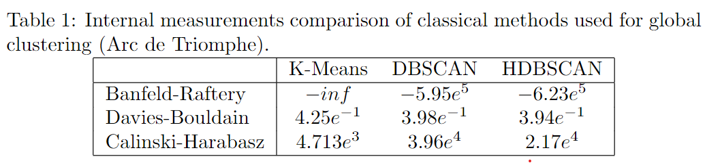
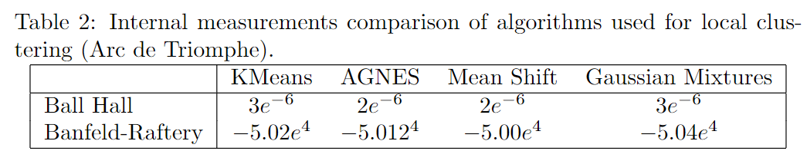
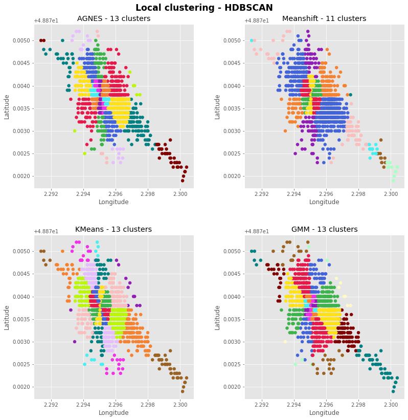

# Arc de Triomphe
## Global clustering
As a reminder, we choose the clustering with the highest **Banfeld-Raftery value**, the lower **Davies-Boudlain index**, and the highest **Calinski-Harabasz index**.
**HDBSCAN** presents the best overall results.  
   
The global clustering also allowed identifying the main photographic spots. We noticed that most of photographic spots use on the internet were
identified with our method. Most of the spots are widely shown is the reference websites about the *Eiffel Tower*: *Arc de Triomphe*, *Place de la Concorde*, *Montmartre*, *Centre Pompidou*, *Printemps Haussman (rooftop)*, *Tour Montparnasse*, *Galeries Lafayette (rooftop)*...   

The global clustering also allowed to identify of photographic spots not present on the reference sites like the two bridges: *Grenelle bridge*, *Mirabeau bridge*, etc.

  

Result map with **HDBSCAN global clustering algorithm**: [Map](https://flaviendeseure.github.io/Clustering-Method-for-Touristic-Photographic-Spots-Recommendation/results/Paris/Arc%20de%20Triomphe/Arc%20de%20Triomphe_HDBSCAN.html)

## Local clustering
Two clusters are selected for the local clustering: A (in dark green) and B (in yellow) from figure 1. In the results, we present the local clustering for the first
selected cluster.

We test the four algorithms: **K-Means**, **Mean Shift**, **DBSCAN**, **Agglomerative clustering**. We compare results with **Ball Hall** and **Benfeld-Raftery index** (table. 2). As a reminder, we choose the clustering with the lowest **Ball Hall value** and **Benfeld-Raftery index**.

  

The results of the algorithms are presented behind. The **GMM** clustering provides the best results which are also close to the urban structure near the
*Eiffel Tower*. From top left to bottom right, we can mention clusters located at *Trocadero’s Garden*, *Alma’s bridge* with *Palais de Tokyo*, *Iéna’s bridge* with
*Carrousel*, closest northern roads (*Quai Branly*), closest eastern roads (*Bourdonnais avenue* and *University*), the inner ring represents the various points of
view at the feet of the tower, then on the left in light blue we got *Bir Hakeim bridge*, following by the *Emile Antoine stadium*, the *Hotel Pullman* and finally
the bottom pink cluster represents the *Champ de Mars*.

  

## Final result
Result maps with **HDBSCAN global clustering algorithm** and all four local clustering algorithms:
- [AGNES](https://flaviendeseure.github.io/Clustering-Method-for-Touristic-Photographic-Spots-Recommendation/results/Paris/Arc%20de%20Triomphe/Arc%20de%20Triomphe_HDBSCAN_AGNES.html)
- [GMM](https://flaviendeseure.github.io/Clustering-Method-for-Touristic-Photographic-Spots-Recommendation/results/Paris/Arc%20de%20Triomphe/Arc%20de%20Triomphe_HDBSCAN_GMM.html)
- [KMeans](https://flaviendeseure.github.io/Clustering-Method-for-Touristic-Photographic-Spots-Recommendation/results/Paris/Arc%20de%20Triomphe/Arc%20de%20Triomphe_HDBSCAN_KMeans.html)
- [Mean Shift](https://flaviendeseure.github.io/Clustering-Method-for-Touristic-Photographic-Spots-Recommendation/results/Paris/Arc%20de%20Triomphe/Arc%20de%20Triomphe_HDBSCAN_Meanshift.html)

## TPS qualification
Global clustering used: **HDBSCAN** 

Local clustering used: **MeanShift**

### Time of day
[Result map](https://flaviendeseure.github.io/Clustering-Method-for-Touristic-Photographic-Spots-Recommendation/results/Paris/Arc%20de%20Triomphe/Time_sundusk-Arc%20de%20Triomphe_HDBSCAN_Meanshift.html)

During our experiments, we discovered good spots for sun dusk as the proportion differs a lot from the reference one (between 7% and 10% of all photos TPS instead of 2.78%). Those spots are on the east, northeast of the *Eiffel Tower*, and they are at a higher altitude. Some spots are close to the POI, tourists capture the sun dusk between the feet of the *Eiffel Tower*. One TPS on the bottom left is the *Grenelle bridge*, and many others are on various bridges. Tourists can see the sun dusk glare on the water in front of the tower. We conclude those spots are ideal to take the sun dusk close to the *Eiffel Tower*.

### Panorama - limited to 30 clusters
[Result map](https://flaviendeseure.github.io/Clustering-Method-for-Touristic-Photographic-Spots-Recommendation/results/Paris/Arc%20de%20Triomphe/Panorama-Arc%20de%20Triomphe_HDBSCAN_Meanshift.html)

Concerning the panorama, we obtained the following map. We found most of panorama’s like *La Défense*, *Montmartre*, *Arc de Triomphe*, some bridges, the *Place de la Concorde*, *Saint Honoré district* and *Les Halles*. Those places offer an advantageous point of view of some parts of Paris and are at higher altitudes or with vast open views. Those results are biased as most tourists want to place the *Eiffel Tower* in every photo.

### Popularity - 15 first clusters
[Result map](https://flaviendeseure.github.io/Clustering-Method-for-Touristic-Photographic-Spots-Recommendation/results/Paris/Arc%20de%20Triomphe/Popularity-Arc%20de%20Triomphe_HDBSCAN_Meanshift.html)

The most popular spots are all around the monument (main global cluster) and in large places (*Place de la Concorde*, *Montmartre*, *Arc de Triomphe*). Moreover, most of the photos on the internet are taken from those places. 
