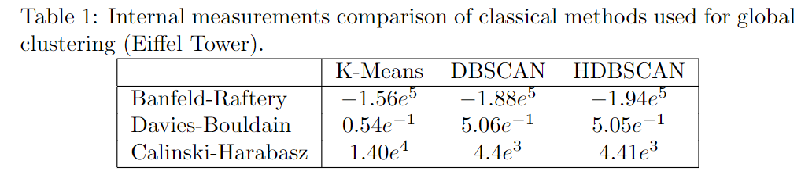
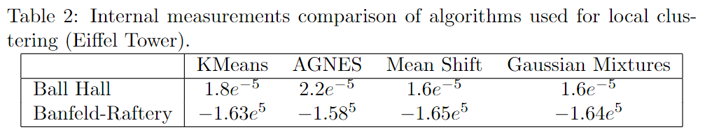
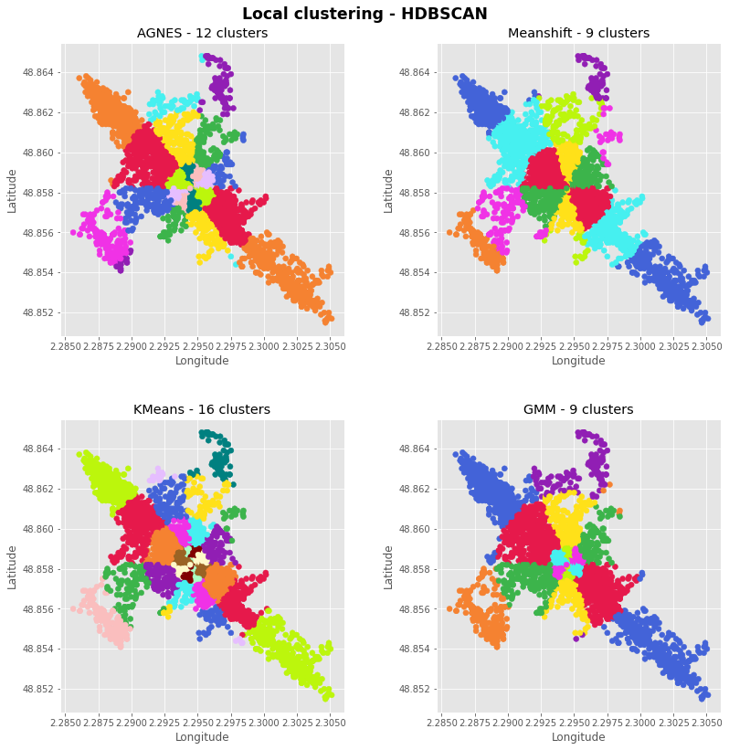

# Eiffel Tower
## Global clustering

  

## Local clustering

  

  

## Final result
Result maps with **HDBSCAN global clustering algorithm** and all four local clustering algorithms:
- [AGNES](https://flaviendeseure.github.io/Clustering-Method-for-Touristic-Photographic-Spots-Recommendation/results/Paris/Eiffel%20Tower/Eiffel_Tower_HDBSCAN_AGNES.html)
- [GMM](https://flaviendeseure.github.io/Clustering-Method-for-Touristic-Photographic-Spots-Recommendation/results/Paris/Eiffel%20Tower/Eiffel_Tower_HDBSCAN_GMM.html)
- [KMeans](https://flaviendeseure.github.io/Clustering-Method-for-Touristic-Photographic-Spots-Recommendation/results/Paris/Eiffel%20Tower/Eiffel_Tower_HDBSCAN_KMeans.html)
- [Mean Shift](https://flaviendeseure.github.io/Clustering-Method-for-Touristic-Photographic-Spots-Recommendation/results/Paris/Eiffel%20Tower/Eiffel_Tower_HDBSCAN_Meanshift.html)

## TPS qualification
Global clustering used: HDBSCAN 

Local clustering used: MeanShift
### Time of day
[Result map](https://flaviendeseure.github.io/Clustering-Method-for-Touristic-Photographic-Spots-Recommendation/results/Paris/Eiffel%20Tower/Time_sundusk-Eiffel_Tower_HDBSCAN_Meanshift.html)

### Panorama
[Result map](https://flaviendeseure.github.io/Clustering-Method-for-Touristic-Photographic-Spots-Recommendation/results/Paris/Eiffel%20Tower/Panorama-Eiffel_Tower_HDBSCAN_Meanshift.html)

### Popularity
[Result map](https://flaviendeseure.github.io/Clustering-Method-for-Touristic-Photographic-Spots-Recommendation/results/Paris/Eiffel%20Tower/Popularity-Eiffel_Tower_HDBSCAN_Meanshift.html)
