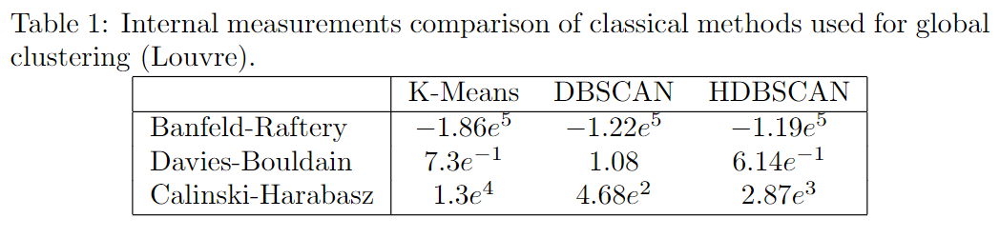

# Musée du Louvre
## Global clustering comparison

  

## Local clustering comparison

  

  

## Final result
link to site: https://flaviendeseure.github.io/Clustering-Method-for-Touristic-Photographic-Spots-Recommendation/results/Paris/Louvre

<iframe src="https://github.com/flaviendeseure/Clustering-Method-for-Touristic-Photographic-Spots-Recommendation/blob/main/results/Paris/Louvre/test.html"></iframe>

   

  

